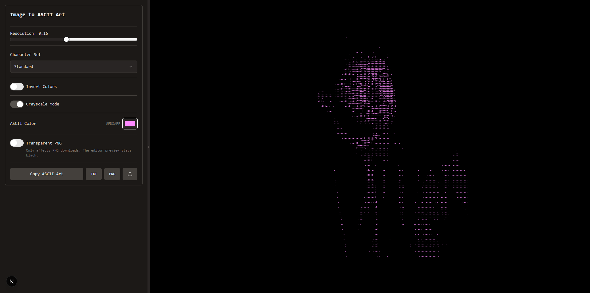

# Image to ASCII Art

A browser-based tool for converting images into ASCII art. It lets you control sampling resolution, choose different character sets, invert brightness, generate monochrome or source-color output, customize the ASCII color, and export the result as plain text or a PNG image.

## Preview



## Features

- Real-time image-to-ASCII conversion.
- Configurable default image at `public/images/original-image.png`.
- Local image upload through file picker or drag and drop.
- Character sets: Standard, Detailed, Binary 0/1, Block Characters, and Minimal.
- Resolution control to balance detail, readability, and output density.
- Monochrome mode with customizable ASCII color.
- Color mode based on the source image palette.
- Brightness inversion for light or dark source images.
- Optional transparent background for PNG downloads.
- Export as `.txt` and `.png`.

## How It Works

The conversion runs entirely in the browser using an internal `canvas`. No backend is required for processing or exporting images.

The general flow is:

1. The source image is loaded as an `HTMLImageElement`, either from the default project image or from a local upload.
2. The full image is drawn into an internal `canvas`.
3. Pixel data is extracted with `getImageData`.
4. The resolution control defines the sampling grid. Higher resolution samples more pixels and generates more characters; lower resolution produces a simpler output.
5. Each sampled pixel is converted into perceived brightness.
6. Brightness is mapped to a character from the selected character set.
7. The result is stored as plain ASCII text and as a matrix of colored characters.
8. A second `canvas` renders the final ASCII output so it can be exported as a PNG image.

Monochrome mode uses classic luminance:

```txt
brightness = (R * 0.299 + G * 0.587 + B * 0.114) / 255
```

Color mode uses a perceived luminance calculation based on normalized RGB channels. Each character then keeps a color derived from the original pixel, adjusted to remain visible against the black output background.

The `Invert Colors` option flips brightness before character selection. This is useful for images with light backgrounds or when the visual reading needs to be reversed.

## Character Set

The `Character Set` selector controls which characters are used to build the output. Each set works as a density scale: earlier characters represent darker or emptier areas, while later characters represent brighter or more visually dense areas.

| Option | Characters | Recommended use |
| --- | --- | --- |
| `Standard` | ` .:-=+*#%@` | Balanced option for most images. Keeps good readability without creating too much noise. |
| `Detailed` | ` .,:;i1tfLCG08@` | Better for images with shadows, volume, or fine detail. Produces richer output but can look denser. |
| `Binary 0/1` | ` 0011` | Converts the image using zeros and ones. Works best with high-contrast images, silhouettes, and clean backgrounds. |
| `Block Characters` | space, `U+2591`, `U+2592`, `U+2593`, `U+2588` | Produces a heavier graphic result, closer to pixel art or block shading. |
| `Minimal` | space, `.`, `:`, `U+2588` | Reduces the image to a few levels. Useful for simple compositions, logos, icons, or silhouettes. |

The binary character set includes leading spaces before `0` and `1`. This prevents dark backgrounds from becoming fully filled with characters and helps preserve the subject silhouette.

## Image Recommendations

The final result depends heavily on image contrast and composition. For better conversions:

- Use black-and-white or high-contrast images.
- Prefer subjects that are clearly separated from the background.
- Avoid busy backgrounds if the goal is to recognize a face, object, or silhouette.
- Images with clear highlights and shadows usually work better than flat images.
- If the result looks too dense, lower the resolution.
- If too much detail is lost, increase the resolution gradually.
- For portraits, use close crops and simple backgrounds.
- For `Binary 0/1`, images with clear silhouettes and dark backgrounds usually work best.

The default source image lives at:

```txt
public/images/original-image.png
```

Replacing that file with another image using the same name will change the initial image loaded by the app.

## Export

The tool can generate two file types:

- `ascii-art.txt`: plain text ASCII output. Useful for editors, documentation, terminals, or messages.
- `ascii-art.png`: rendered image output. By default it uses a black background, but `Transparent PNG` can export it with an alpha channel for compositing over a website or design.

You can also copy the ASCII text directly to the clipboard with the `Copy ASCII Art` button.

## Local Development

### Requirements

- Node.js 20 or newer recommended.
- pnpm installed.

If you do not have pnpm installed:

```bash
npm install -g pnpm
```

### Clone and Install

```bash
git clone https://github.com/dersck/image-to-ascii-art.git
cd image-to-ascii-art
pnpm install
```

### Start the Development Server

```bash
pnpm dev
```

The app runs at:

```txt
http://127.0.0.1:3001
```

The port is defined in the `dev` script inside `package.json`.

### Validate TypeScript

```bash
pnpm lint
```

In this project, the lint script runs:

```bash
tsc --noEmit
```

### Production Build

```bash
pnpm build
pnpm start
```

Avoid running `pnpm build` while `pnpm dev` is active. If Next.js ends up with mixed cache artifacts, stop the server, delete `.next`, and start development again:

```bash
pnpm dev
```

## Relevant Structure

```txt
app/
  layout.tsx        Metadata, favicon, and global layout.
  page.tsx          Main page entry point.
ascii-converter.tsx
  Main component: image loading, processing, rendering, and export.
public/
  favicon.svg
  images/
    original-image.png
components/ui/
  UI components used by the controls.
```

## Implementation Notes

- Conversion runs completely in the browser.
- Uploaded images are not sent to any server.
- Downloadable rendering uses a separate canvas from the internal processing canvas.
- Custom ASCII color applies to monochrome mode. In color mode, the output color comes from the source image.
- PNG output uses a black background by default to preserve contrast and readability. Enable `Transparent PNG` when the artwork needs to be layered over an existing web background.
